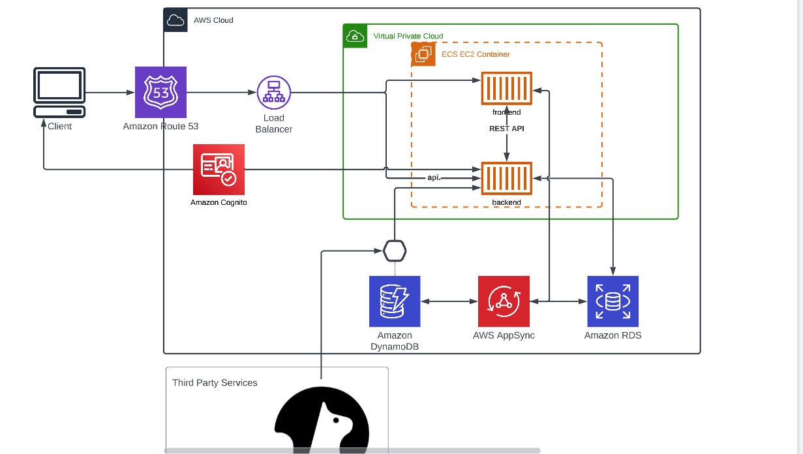
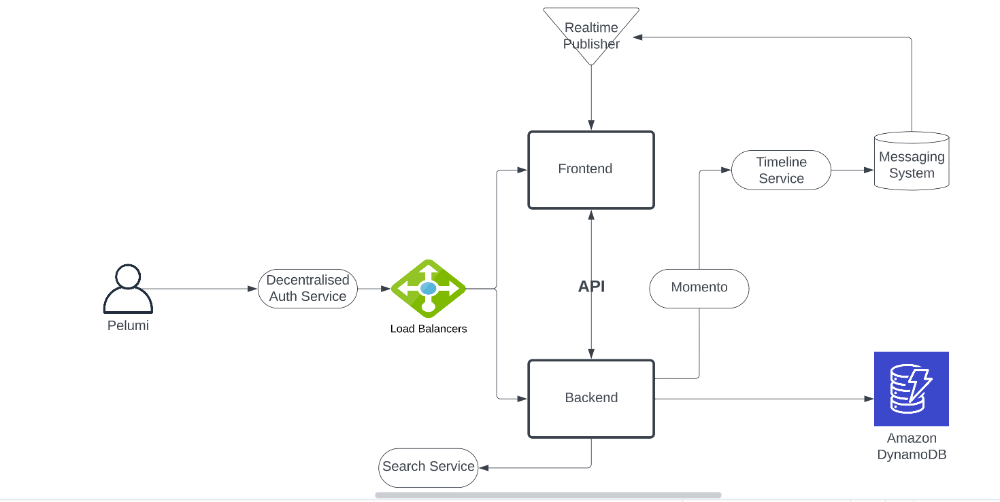

# Week 0 — Billing and Architecture

## Required Homework
I recreated logical architectural diagram with Lucid Charts
[Cruddur- logicalarchitectural Diagram](https://lucid.app/lucidchart/df108c43-e494-41e2-9c75-9ade8ec3b4bf/edit?viewport_loc=-91%2C-11%2C2219%2C1079%2C0_0&invitationId=inv_4c40f3b8-52c1-4c16-921e-5aa35e33d559)
### Diagram

Created conceptual diagram with lucid chart
[concenptual diagram proof](https://lucid.app/lucidchart/45bfbbab-8413-4704-a428-1ecadcaac5d9/edit?viewport_loc=-287%2C30%2C1768%2C819%2C0_0&invitationId=inv_d20ecf3a-aaf0-4535-bf3a-324076b9480e)

## Homework Challenges
